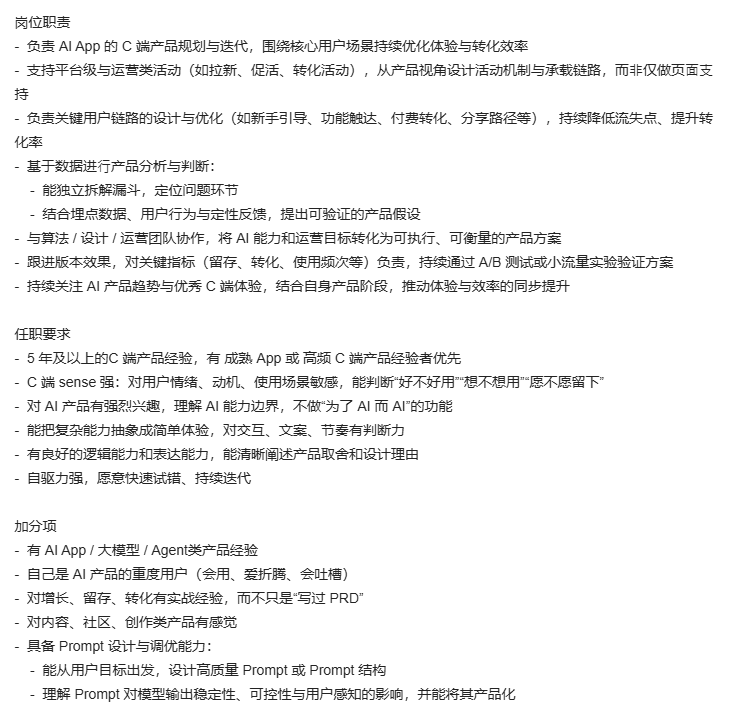

## 岗位职责
- 负责 AI App 的 C端产品规划与迭代，围绕核心用户场景持续优化体验与转化效率支持平台级与运营类活动(如拉新、促活、转化活动)，从产品视角设计活动机制与承载链路，而非仅做页面支持
- 负责关键用户链路的设计与优化(如新手引导、功能触达、付费转化、分享路径等)，持续降低流失点、提升转化率
- 基于数据进行产品分析与判断:
    - 能独立拆解漏斗，定位问题环节
    - 结合埋点数据、用户行为与定性反馈，提出可验证的产品假设
- 与算法/设计/运营团队协作，将 A1能力和运营目标转化为可执行、可衡量的产品方案跟
- 进版本效果，对关键指标(留存、转化、使用频次等)负责，持续通过 AB 测试或小流星实验验证方案
- 持续关注 AI 产品趋势与优秀 C端体验，结合自身产品阶段，推动体验与效率的同步提升

任职要求
- 5 年及以上的C 端产品经验，有 成熟 App 或 高频 C端产品经验者优先
- C 端 sense 强:对用户情绪、动机、使用场景敏感，能判断“好不好用”"想不想用”“愿不愿留下
- 对 AI 产品有强烈兴趣，理解 A1 能力边界，不做“为了 A 而 A”的功能
- 能把复杂能力抽象成简单体验，对交互、文案、节奏有判断力
- 有良好的逻辑能力和表达能力，能清晰阐述产品取舍和设计理由
- 自驱力强，愿意快速试错、持续迭代

加分项
- 有 AIApp/大模型/Agent类产品经验
- 自己是 AI 产品的重度用户(会用、爱折腾、会吐槽)
- 对增长、留存、转化有实战经验，而不只是“写过 PRD
- 对内容、社区、创作类产品有感觉
- 具备 Prompt 设计与调优能力:
    - 能从用户目标出发，设计高质量 Prompt或Prompt结构
    - 理解 Prompt 对模型输出稳定性、可控性与用户感知的影响，并能将其产品化