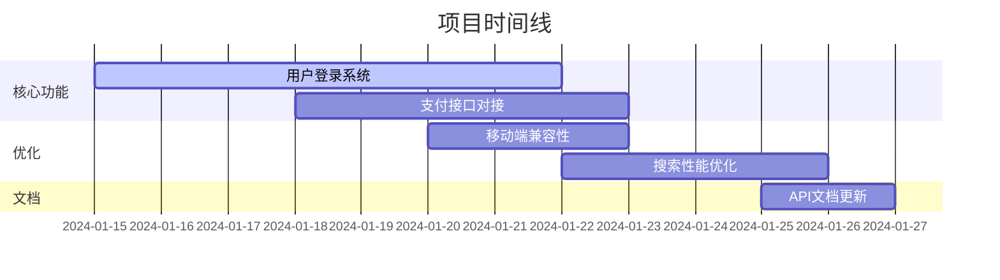

# 📋 **Markdown All in One 任务管理模板**

## 🎯 **项目总览**
**项目名称**：产品开发计划  
**创建日期**：2024-01-20  
**负责人**：@你的名字  
**状态**：🟡 进行中  

---

## 📋 **任务总览**
- **总任务数**：8
- **已完成**：3 (38%)
- **进行中**：4 (50%)
- **未开始**：1 (12%)

---

## 🔥 **本周重点（优先级排序）**
> 💡 *提示：在 VS Code/Cursor 中可拖拽任务重新排序*

### 🟥 **高优先级（P0）**
- [ ] **核心功能开发**
  - [ ] 用户登录系统重构
  - [ ] 支付接口对接
  - [x] 数据库设计完成 ✓
  
- [ ] **紧急修复**
  - [x] 解决首页加载缓慢问题 ✓
  - [ ] 修复移动端兼容性问题

### 🟨 **中优先级（P1）**
- [ ] **功能优化**
  - [ ] 搜索功能性能优化
  - [ ] 用户反馈收集系统
  
- [ ] **文档编写**
  - [ ] API 接口文档更新
  - [x] 用户手册初稿完成 ✓

### 🟩 **低优先级（P2）**
- [ ] **技术债务**
  - [ ] 代码注释补充
  - [ ] 单元测试覆盖率提升

---

## 📅 **时间线规划**

### **2024年1月第三周**


### **今日待办**
- [x] 晨会同步进度 (09:30)
- [ ] 评审登录系统设计方案 (14:00)
- [ ] 编写支付接口测试用例
- [ ] 回复用户反馈邮件

---

## 👥 **团队分工**

| 成员 | 负责模块 | 本周任务 | 状态 |
|------|----------|----------|------|
| 张三 | 后端开发 | 支付接口对接 | 🔄 进行中 |
| 李四 | 前端开发 | 移动端兼容性 | ✅ 已完成 |
| 王五 | 测试 | 编写测试用例 | 🕒 待开始 |
| 赵六 | 产品 | 需求文档整理 | 🔄 进行中 |

---

## 📊 **进度追踪**

### **按模块统计**
```markdown
✅ 已完成 (3)
  ├── 数据库设计
  ├── 首页性能优化  
  └── 用户手册初稿

🔄 进行中 (4)
  ├── 用户登录系统 (60%)
  ├── 支付接口对接 (30%)
  ├── 移动端兼容性 (80%)
  └── 需求文档整理 (40%)

🕒 未开始 (1)
  └── 单元测试提升
```

### **燃尽图**（示例）
```
进度: ██████████████████░░░░ 78%
剩余: ████░░░░░░░░░░░░░░░░░░ 22%
截止: 2024-01-31
```

```python
# Python 脚本生成
def create_burn_down(total, completed, width=20):
    """生成燃尽图文本"""
    filled = int(completed / total * width)
    empty = width - filled
    
    progress_bar = "█" * filled + "░" * empty
    percentage = (completed / total) * 100
    
    return f"进度: {progress_bar} {percentage:.1f}%"

# 使用示例
print(create_burn_down(100, 78, width=20))
# 输出: 进度: ██████████████████░░░░ 78.0%
```

**访问这些网站快速生成：**
Textik：https://textik.com/
ASCII Art Generator：https://www.ascii-art-generator.org/
Text-Emoticons：直接复制预制模板

---

## 📝 **详细任务说明**

### **任务：用户登录系统重构**
```markdown
**ID**: TASK-001
**创建时间**: 2024-01-15
**预估工时**: 5人日
**实际耗时**: 3人日（进行中）
**依赖项**: 数据库设计完成
**验收标准**:
- [ ] 支持手机号/邮箱登录
- [ ] 集成短信验证码
- [ ] 安全日志记录完整
- [ ] 响应时间 < 200ms
**备注**: 需要与第三方短信服务商对接
```

### **任务：支付接口对接**
```markdown
**ID**: TASK-002  
**创建时间**: 2024-01-18
**负责人**: @张三
**状态**: 🔄 开发中 (30%)
**相关文档**:
- [支付接口文档](./docs/payment-api.md)
- [测试用例](./tests/payment-test.md)
**风险点**:
- 第三方支付回调延迟
- 对账系统同步问题
```

---

## 🔧 **VS Code/Cursor 使用技巧**

### **快捷键**
```bash
Ctrl + Enter      # 切换任务完成状态
Alt + ↑/↓         # 上下移动任务行
Tab / Shift+Tab   # 调整缩进级别（创建子任务）
Ctrl + Shift + P  # 打开命令面板 → 搜索 "Format Document"
```

### **拖拽操作**
1. **鼠标悬停**在任务前的 `- [ ]` 上
2. **光标变为手掌图标**时
3. **拖动到新位置**释放
4. 列表会自动重新编号

### **自动格式化**
```json
// 在 settings.json 中添加
{
  "[markdown]": {
    "editor.formatOnSave": true,
    "editor.quickSuggestions": false
  },
  "markdown.extension.list.indentationSize": "inherit",
  "markdown.extension.orderedList.autoRenumber": true
}
```

---

## 📁 **文件结构建议**
```
项目名称/
├── README.md              # 项目说明
├── TODO.md               # 主任务文件（当前文件）
├── docs/                 # 文档
│   ├── api/             # API文档
│   ├── design/          # 设计文档
│   └── meeting-notes/   # 会议记录
├── tasks/               # 详细任务分解
│   ├── task-001-login.md
│   ├── task-002-payment.md
│   └── task-003-mobile.md
└── archive/             # 归档已完成任务
    └── 2024-01-completed.md
```

---

## 📌 **使用说明**
1. **复制此模板**到你的项目中
2. **重命名各部分**以匹配你的项目
3. **使用拖拽功能**随时重新排序任务
4. **定期更新**进度百分比和状态
5. **归档已完成任务**保持列表清晰

---

> **提示**：此模板充分利用了 Markdown All in One 的以下功能：
> - ✅ 任务列表拖拽排序  
> - ✅ 多级列表缩进管理
> - ✅ 表格和代码块支持
> - ✅ 目录自动生成（Cmd+Shift+P → "Create Table of Contents"）

你可以将此模板保存为 `project-todo-template.md`，每次新项目时复制使用。需要我针对特定类型的项目（如开发、学习、个人生活）调整模板吗？