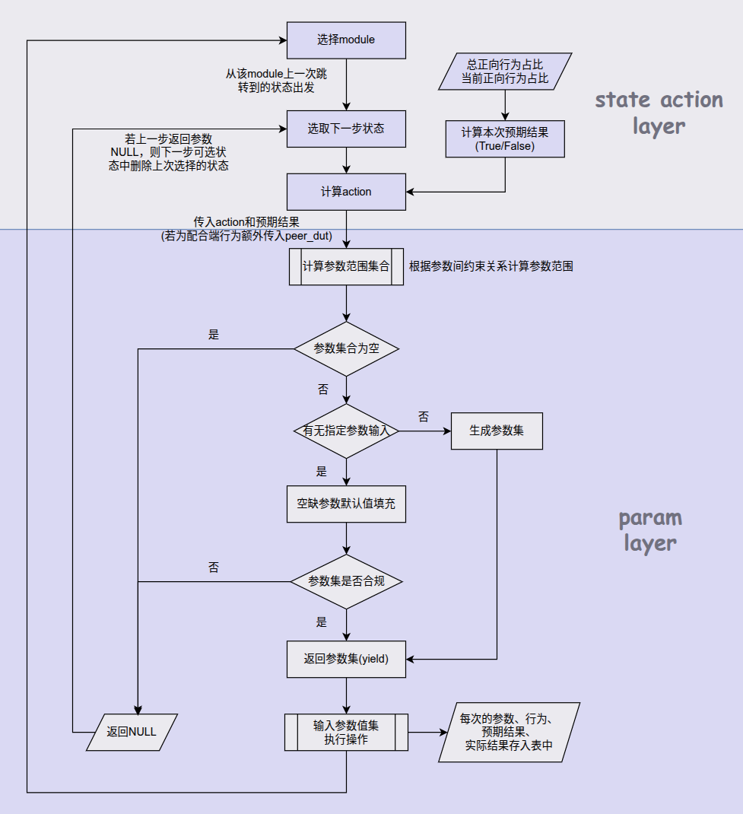

目标： 随机模式能否覆盖开发想要的测试场景

**随机模式会覆盖哪些场景**
- 测试角度
    > 正向验证 - 符合spec规则是否能顺利执行
    反向验证 - 违反spec规则是否会报错
    正向反向比例可控

    > 当前某一步出现错误，在不做teardown的情况下，后面的行为能否顺利执行

- 测试场景
    > 覆盖场景: adv/scan/random_addr/wl/bond/smp/conn/gatts/gattc/pa/gpio/pawr/cte
    > 当前不放入随机模式的场景： 抢占/时序/past/电流测试/sleep

- 测试形态
   > 一端作为被测端，对其采取随机模式
   > 设置配合端，根据被测端行为和参数确定配合的行为和参，来辅助验证被测端的行为


    adv_interval scan占空比 scan_timeout是否要放入随机模式？
    - adv_interval scan占空比 scan_timeout在性能测试/压测中已经覆盖
    - scan_window和scan_interval有效性通过电流图确定
    - 如果放入计算公式是什么？ swl给出过一个，所有人是否认可？
    - 能否cover空气中测试？长短包和干扰
    - 若都认可且认为可以cover，随机出问题不能认为是QA的问题

---
**随机模式的随机是指什么？**
- 状态行为随机
- 参数随机

确定module -> 确定next_state -> 确定action -> 确定param
>*module: adv/ext_adv/scan/ext_scan/random_addr/wl/bond/smp/conn/gatts/gattc/pa/gpio/pawr/cte*


**随机模式流程**


---

**状态行为随机**
假设随机到的module是adv
adv所有状态： IDLE, STOP, START
状态转移过程通过状态转移矩阵实现：
》》
```python
class AdvTrans(BaseTrans):
    STATE = ['IDLE', 'STOP', 'START']
    TRANS_ACTION: dict[int, list[int | str | None]] = {
        #  IDLE                 STOP                  START
        0: [None,                         2,        'start_adv'],     # IDLE
        1: ['clear_adv', 'set_adv_raw_data',        'start_adv'],     # STOP
        2: [1,                   'stop_adv', 'set_adv_raw_data']      # START
    }
```
将矩阵索引与状态进行映射 -- 0：IDLE  1：STOP  2：START
状态分为当前状态和下一步状态，状态转移矩阵TRANS_ACTION，行索引i表示当前状态，列索引j表示下一步状态
TRANS_ACTION[i][j]表示从从i状态转移到j状态，需要经历的路径

TRANS_ACTION[0][1] = 2 表示从IDLE状态到STOP状态要先经过2状态 -> 路径为[TRANS_ACTION[0][2], TRANS_ACTION[2][1]] -> ['start_adv', 'stop_adv']
在每一个当前状态随机选择下一个要到达的状态，生成路径

---

